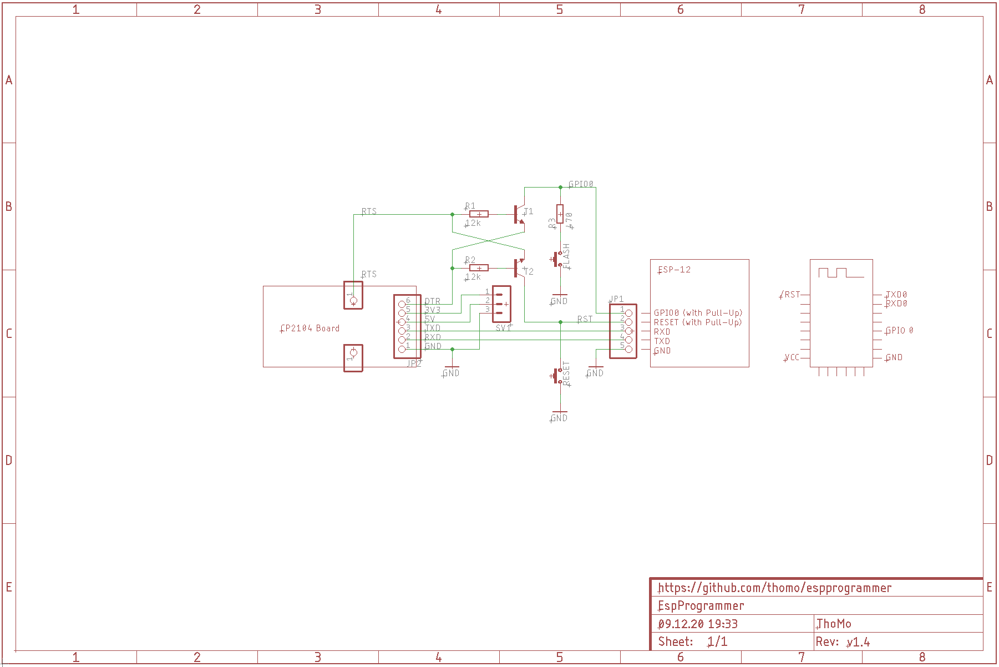

# ESP Programmer

It is a small board which add just some logic to provide ESP-12 auto programming using a CP2104 board. Just connect the board to your ESP-12 board and you can upload your code like when using a Nodemcu board.

Design is based on information from

- <https://tttapa.github.io/ESP8266/Chap06%20-%20Uploading.html>
- <https://github.com/nodemcu/nodemcu-devkit-v1.0/blob/master/NODEMCU_DEVKIT_V1.0.PDF>

## Prototype

## Circuit

## PCB

The board can be ordered from OSH Park: <a href="https://oshpark.com/shared_projects/NfFR529p"></img></a>

## License

[MIT License](LICENSE)
